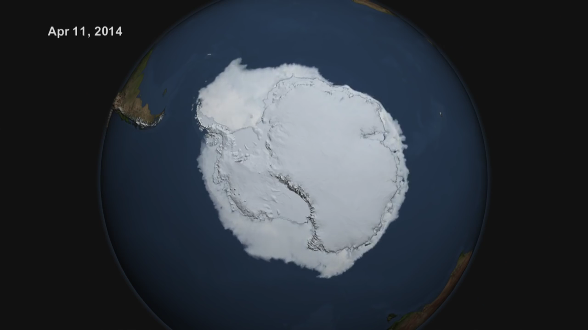
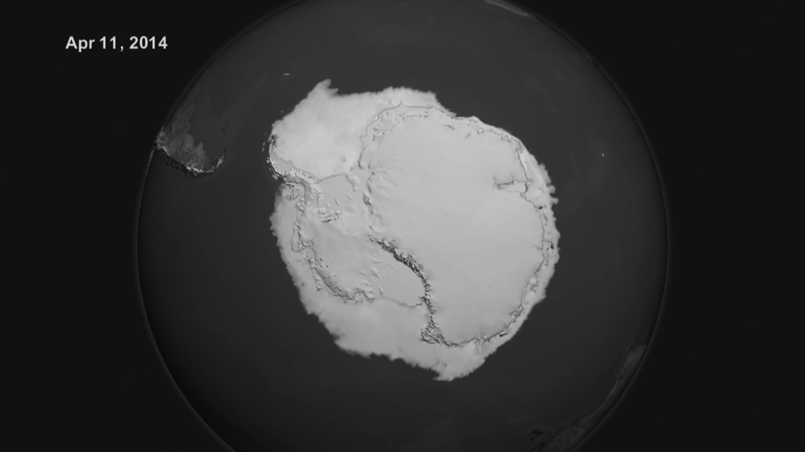
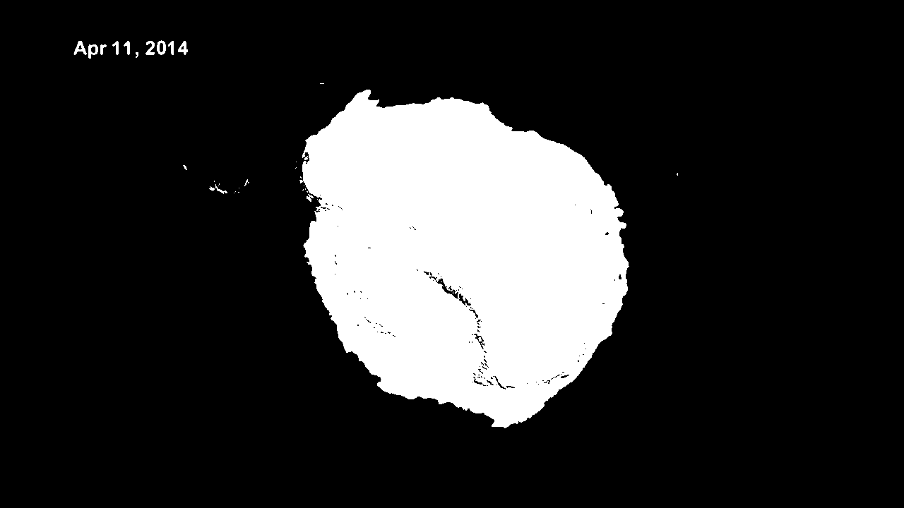
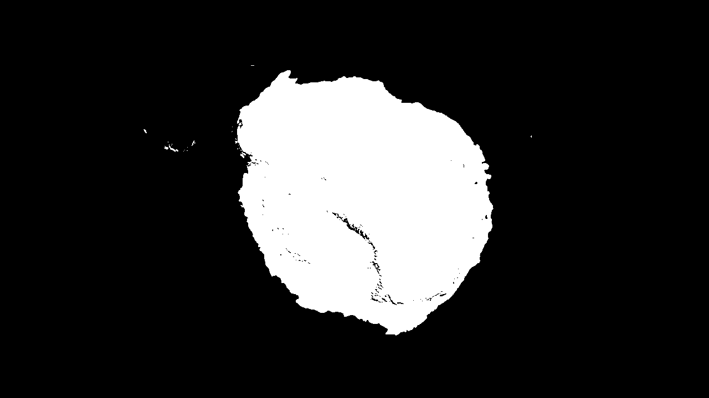

Climate Change and The Antarctic Sea Ice Extent
===============================================
_Visual to Statistics_  

UBC Elec 221: Signals and Systems Winter 2016  

A project to observe and analyze the increase in ice coverage of the Antarctic from March to September 2014 using image processing.  

  
`color`  
  
`grayscale`  
  
`black & white`  
  
`date mask`  
  
`spatial filter`  

